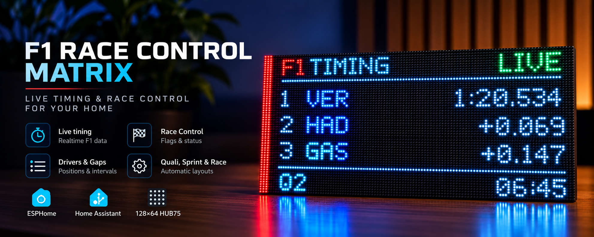

  

# F1 Race Control Matrix

  <strong>🇬🇧 English</strong> &nbsp;|&nbsp; <a href="README.nl.md">🇳🇱 Nederlands</a>

An unofficial community project for a 128×64 HUB75 LED matrix powered by ESPHome and Home Assistant.

The project turns a Waveshare ESP32-S3 RGB Matrix controller and HUB75 panel into a compact race-control and live-timing display with session labels, top-three timing, race gaps, lap count, track-status animations, qualifying elimination screens, and adjustable F1TV/Viaplay synchronization.

> **Status:** release candidate. The current configuration has passed compile validation and is undergoing final live-session testing before the first public release.

## Hardware

- Waveshare ESP32-S3 RGB Matrix board (ESP32-S3-N32R16)
- 128×64 HUB75/HUB75E RGB matrix
- Tested panel: P2.5, 320×160 mm, 1/32 scan
- 5 V power supply with sufficient current capacity (a Raspberry Pi 5 27 W USB-C power adapter is sufficient for the tested 128×64 panel setup)
- Home Assistant
- ESPHome 2026.9.0

## Features

- F1 Race Control / live timing page
- Practice, Qualifying, Sprint Qualifying, Sprint and Race session handling
- Q1/Q2/Q3 session labels
- Top-three timing and race gaps
- Current/total lap display for Race and Sprint
- GREEN, YELLOW, RED, VSC, SC and CHEQUERED animations
- 10-minute timing hold after a session finishes
- Race Control standby screen outside sessions
- F1TV/Viaplay synchronization control
- Qualifying elimination overlay (experimental)
- Automatic page switch shortly before a session

## Repository layout

- `esphome/` — ESPHome firmware and example secrets
- `home-assistant/` — template sensors and automations
- `docs/` — hardware, installation and entity documentation
- `CHANGELOG.md` — project changes

## Important

This project is unofficial and is not affiliated with, endorsed by, or connected to Formula 1, the FIA, Formula One Management, or any broadcaster.

No official Formula 1 logos or copyrighted broadcast graphics are included in this repository. Users are responsible for the data source/integration they connect to Home Assistant and for complying with its terms and applicable rights.

## Current release candidate

The release candidate is based on the tested **V12.6.37** development line and has been sanitized for distribution. Credentials are externalized through ESPHome secrets. The secure public build compiled successfully with ESPHome 2026.9.0 / ESP-IDF 5.5.5 on 25 September 2026.

## License

MIT. See `LICENSE`.
